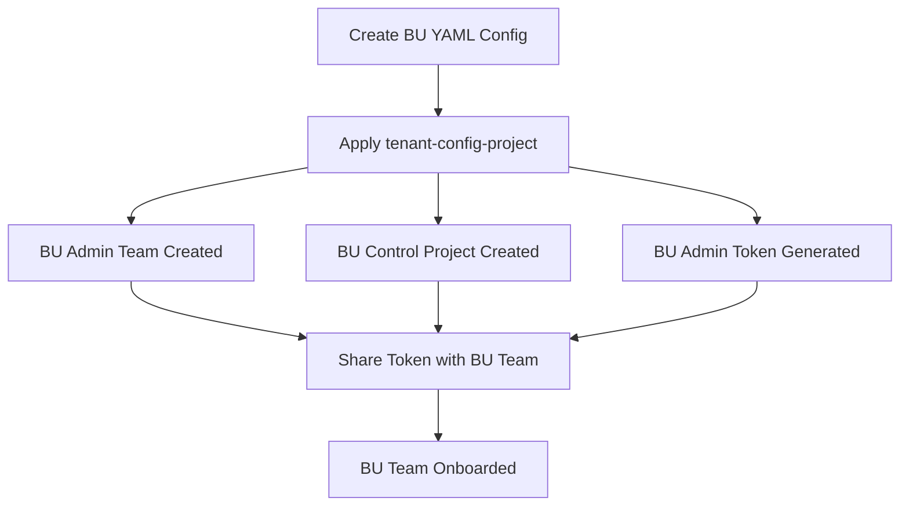
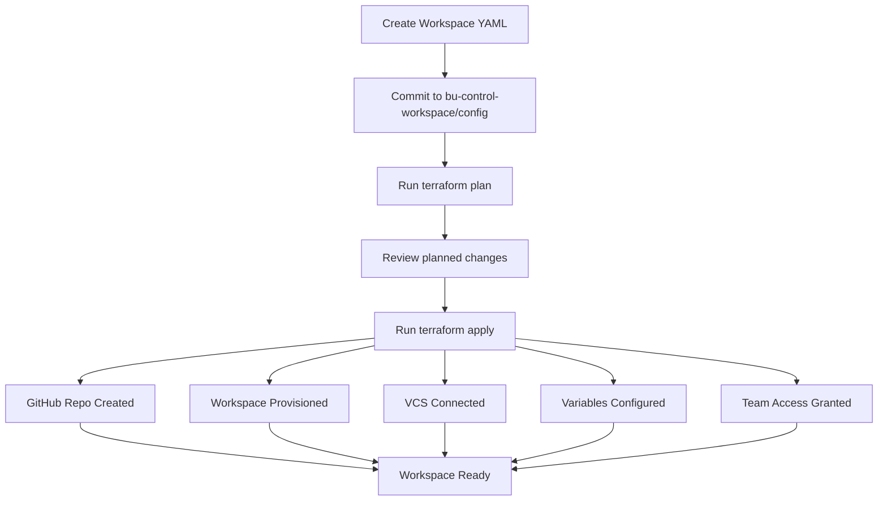

# Repository Setup Guide

This guide walks you through configuring GitHub Secrets, Variables, and initial setup for the HCP Terraform Platform Team Onboarding Module.

## Table of Contents

- [Prerequisites](#prerequisites)
- [Platform Team Setup](#platform-team-setup)
- [Business Unit Team Setup](#business-unit-team-setup)
- [GitHub Configuration](#github-configuration)
- [YAML Configuration](#yaml-configuration)
- [Workflow Overview](#workflow-overview)
- [Troubleshooting](#troubleshooting)

## Prerequisites

Before starting, ensure you have:

1. **HCP Terraform Organization**
   - Organization owner or admin access
   - Ability to create teams and projects
   - API tokens for authentication

2. **GitHub Organization** (Optional but recommended)
   - Organization admin access for repository creation
   - OAuth connection configured in HCP Terraform
   - Template repository available (e.g., `tf-template`)

3. **Local Development Environment**
   - Terraform CLI 1.6+ installed
   - Git installed and configured
   - Code editor (VS Code recommended)
   - Pre-commit hooks (optional but recommended)

## Platform Team Setup

### Step 1: Create Platform Team Token

1. Navigate to HCP Terraform → **Settings** → **Teams**
2. Create or select your **Platform Team**
3. Click **Team API Token** → **Create a team API token**
4. Copy the token (you won't see it again!)
5. Save securely (e.g., password manager)

**Required Permissions:**
- ✅ Manage projects
- ✅ Manage teams
- ✅ Manage variable sets
- ✅ Manage workspaces (in platform team project)

### Step 2: Configure Platform Team Environment

Create a `tenant-config-project/terraform.tfvars` file:

```hcl
tfc_organization_name = "your-org-name"
business_unit         = "platform"  # or your platform team name
```

**Never commit `terraform.tfvars` to version control!** (Already in `.gitignore`)

### Step 3: Set Platform Team Token

```bash
export TFE_TOKEN="your-platform-team-token"

# Or create ~/.terraformrc
cat > ~/.terraformrc <<EOF
credentials "app.terraform.io" {
  token = "your-platform-team-token"
}
EOF
```

### Step 4: Initialize and Apply Platform Configuration

```bash
cd tenant-config-project
terraform init
terraform plan
terraform apply
```

**Outputs to capture:**
- `bu_admin_team_ids` - Team IDs for each BU
- `bu_control_project_ids` - Project IDs for each BU
- `consumer_project_ids` - All project IDs (pass to BU teams)

**Example capturing outputs:**
```bash
terraform output -json bu_control_project_ids > ../bu_project_ids.json
terraform output -json consumer_project_ids > ../consumer_project_ids.json
```

## Business Unit Team Setup

### Step 1: Obtain BU Admin Token

The platform team creates BU admin teams and tokens. Retrieve your BU admin token:

**Option A: From Platform Team**
- Platform team provides the token securely (encrypted email, vault, etc.)

**Option B: From HCP Terraform UI**
1. Log into HCP Terraform
2. Navigate to **Settings** → **Variable Sets**
3. Find your BU admin variable set (e.g., `strategy_admin`)
4. View the `TFE_TOKEN` variable (requires permissions)

**Option C: From Terraform Output**
```bash
# Platform team exports sensitive output
cd tenant-config-project
terraform output -raw bu_admin_team_tokens
```

### Step 2: Configure BU Control Workspace

Create `bu-control-workspace/terraform.tfvars`:

```hcl
organization    = "your-org-name"
github_org      = "your-github-org"
github_org_owner = "your-github-org"
oauth_token_id  = "ot-xxxxxxxxxxxxx"  # From HCP Terraform VCS settings
bu_projects     = jsonencode({
  "strategy_applications" = "prj-abc123"
  "strategy_shared"       = "prj-def456"
})
```

**Get OAuth Token ID:**
1. HCP Terraform → **Settings** → **Version Control**
2. Find your GitHub connection
3. Copy the OAuth Token ID (starts with `ot-`)

**Get Project IDs:**
```bash
# From platform team output file
cat ../consumer_project_ids.json
```

### Step 3: Set BU Admin Token

```bash
export TFE_TOKEN="your-bu-admin-token"

# Or update ~/.terraformrc
cat > ~/.terraformrc <<EOF
credentials "app.terraform.io" {
  token = "your-bu-admin-token"
}
EOF
```

### Step 4: Create Workspace Configuration

Create YAML files in `bu-control-workspace/config/`:

```yaml
# config/my-first-workspace.yaml
workspace_name: "my-app-dev"
workspace_description: "Development environment for my application"
project_name: "strategy_applications"
project_id: "prj-abc123"  # From platform team output

workspace_terraform_version: "1.6.0"
workspace_tags: ["development", "application"]
workspace_auto_apply: false

# Create GitHub repo
create_repo: true
github:
  github_repo_name: "my-app-infra"
  github_repo_desc: "Terraform infrastructure for my application"
  github_repo_visibility: "private"
  github_template_repo: "tf-template"

# VCS connection
vcs_repo:
  identifier: "your-github-org/my-app-infra"
  branch: "main"

# Variables
variables:
  environment:
    value: "development"
    category: "terraform"
    description: "Environment name"

# Team access
workspace_write_access_emails: ["admin@company.com"]
workspace_plan_access_emails: ["developer@company.com"]
```

### Step 5: Initialize and Apply BU Configuration

```bash
cd bu-control-workspace
terraform init
terraform plan
terraform apply
```

## GitHub Configuration

### OAuth Application Setup

1. **Navigate to HCP Terraform**
   - Settings → Version Control → Add VCS Provider

2. **Select GitHub.com or GitHub Enterprise**

3. **Register OAuth Application in GitHub**
   - GitHub → Settings → Developer settings → OAuth Apps → New OAuth App
   - **Application name**: `HCP Terraform - [Your Org]`
   - **Homepage URL**: `https://app.terraform.io`
   - **Authorization callback URL**: `https://app.terraform.io/auth/[YOUR_ORG_ID]/callback`

4. **Complete Connection**
   - Copy Client ID and Client Secret to HCP Terraform
   - Authorize the application
   - Copy the OAuth Token ID for use in configurations

### Template Repository

Create a template repository with standard Terraform structure:

```
tf-template/
├── .gitignore
├── .pre-commit-config.yaml
├── main.tf
├── variables.tf
├── outputs.tf
├── versions.tf
├── README.md
└── examples/
    └── basic/
```

**Make it a template:**
1. Navigate to repository **Settings**
2. Enable **Template repository** checkbox

## YAML Configuration

### Business Unit Configuration (Platform Team)

```yaml
# tenant-config-project/config/strategy.yaml
bu: "strategy"
description: "Strategy and Architecture team"

# Optional: SSO integration
team:
  sso_team_id: "team_abc123"

# Projects for this BU
projects:
  applications:
    description: "Application workspaces"
    team_project_access:
      developers:
        access: "write"
      architects:
        access: "admin"
    
    # Optional: Project-wide variables
    var_sets:
      variables:
        BUSINESS_UNIT:
          value: "strategy"
          category: "env"
          description: "Business unit identifier"
          sensitive: false

  shared:
    description: "Shared infrastructure workspaces"
    team_project_access:
      platform_team:
        access: "admin"
```

### Workspace Configuration (BU Team)

**Minimal Configuration:**
```yaml
workspace_name: "simple-workspace"
workspace_description: "Simple workspace example"
project_name: "strategy_applications"
project_id: "prj-abc123"
```

**Complete Configuration:**
```yaml
workspace_name: "production-app"
workspace_description: "Production application infrastructure"

# Project assignment
project_name: "strategy_applications"
project_id: "prj-abc123"
create_project: false

# Workspace settings
workspace_terraform_version: "1.6.0"
workspace_tags: ["production", "critical", "application"]
workspace_auto_apply: false
queue_all_runs: false
assessments_enabled: true

# GitHub integration
create_repo: true
github:
  github_org: "your-org"
  github_org_owner: "your-org"
  github_repo_name: "prod-app-infra"
  github_repo_desc: "Production application Terraform"
  github_repo_visibility: "private"
  github_template_owner: "your-org"
  github_template_repo: "tf-template"
  github_template_include_branches: false

# VCS settings
vcs_repo:
  identifier: "your-org/prod-app-infra"
  branch: "main"
  ingress_submodules: false

file_triggers_enabled: true
workspace_vcs_directory: "/"

# Variables
variables:
  environment:
    value: "production"
    category: "terraform"
    description: "Environment tier"
    hcl: false
    sensitive: false
  
  AWS_REGION:
    value: "us-east-1"
    category: "env"
    description: "AWS region"
    sensitive: false
  
  DATABASE_PASSWORD:
    value: "secret-from-vault"
    category: "env"
    description: "Database admin password"
    sensitive: true

# Variable sets
create_variable_set: true
var_sets:
  - variable_set_name: "prod-app-vars"
    variable_set_description: "Production app variables"
    tags: ["production"]
    global: false
    variables:
      APP_VERSION:
        value: "1.2.3"
        category: "terraform"
        description: "Application version"

# Remote state sharing
remote_state: true
remote_state_consumers: ["ws-abc123", "ws-def456"]

# Agent execution (if using self-hosted agents)
workspace_agents: false
execution_mode: "remote"
agent_pool_name: null

# RBAC
workspace_read_access_emails:
  - "viewer@company.com"
  - "auditor@company.com"

workspace_plan_access_emails:
  - "developer@company.com"
  - "qa@company.com"

workspace_write_access_emails:
  - "admin@company.com"
  - "sre@company.com"
```

## Workflow Overview

### Platform Team Workflow



**Steps:**
1. Create YAML configuration for new BU in `tenant-config-project/config/`
2. Run `terraform plan` to preview changes
3. Run `terraform apply` to create BU infrastructure
4. Capture outputs (project IDs, team IDs)
5. Securely share BU admin token with BU team
6. Document project IDs and naming conventions
7. BU team can now self-service workspaces

### Business Unit Workflow



**Steps:**
1. Define workspace in YAML (`bu-control-workspace/config/`)
2. Commit YAML to version control
3. Run `terraform plan` to validate
4. Review planned resources (repos, workspaces, variables)
5. Run `terraform apply` to provision
6. Verify workspace in HCP Terraform UI
7. Clone generated GitHub repository
8. Begin writing Terraform code for application

## Troubleshooting

### Common Issues

#### Issue: "Error: Unauthorized"

**Cause:** Invalid or expired TFE_TOKEN

**Solution:**
```bash
# Verify token is set
echo $TFE_TOKEN

# Update token
export TFE_TOKEN="your-new-token"

# Or update ~/.terraformrc
vim ~/.terraformrc
```

#### Issue: "Project not found"

**Cause:** Incorrect project_id in workspace YAML

**Solution:**
```bash
# Get project IDs from platform team output
cd tenant-config-project
terraform output consumer_project_ids

# Update workspace YAML with correct project_id
```

#### Issue: "OAuth token not found"

**Cause:** Incorrect oauth_token_id in bu-control-workspace

**Solution:**
1. HCP Terraform → Settings → Version Control
2. Copy OAuth Token ID (starts with `ot-`)
3. Update `terraform.tfvars` with correct ID

#### Issue: "GitHub repository already exists"

**Cause:** Repository name conflict

**Solution:**
1. Change `github_repo_name` in workspace YAML
2. Or delete existing repository (if safe to do so)
3. Or set `create_repo: false` to skip repo creation

#### Issue: "Email not found in organization"

**Cause:** Email in `workspace_*_access_emails` doesn't match org member

**Solution:**
1. Verify email addresses match HCP Terraform user emails exactly
2. Ensure users are invited to organization
3. Remove invalid emails from workspace YAML

### Validation Checks

**Before applying platform configuration:**
```bash
cd tenant-config-project

# Validate YAML syntax
yamllint config/*.yaml

# Validate Terraform
terraform fmt -check -recursive
terraform validate

# Preview changes
terraform plan
```

**Before applying BU configuration:**
```bash
cd bu-control-workspace

# Validate YAML
yamllint config/*.yaml

# Check project IDs are correct
grep -r "project_id" config/

# Validate Terraform
terraform validate

# Preview with detailed logging
TF_LOG=DEBUG terraform plan
```

### Getting Help

- **Documentation**: Review README.md and examples/
- **Logs**: Enable debug logging with `TF_LOG=DEBUG terraform apply`
- **HCP Terraform UI**: Check organization audit logs
- **GitHub Issues**: Report bugs or request features
- **HashiCorp Community**: https://discuss.hashicorp.com/c/terraform-cloud

## Next Steps

After completing setup:

1. ✅ **Review Examples** - Check `examples/` directory for patterns
2. ✅ **Enable Pre-commit** - Run `pre-commit install` for code quality
3. ✅ **Set Up CI/CD** - Configure GitHub Actions for validation
4. ✅ **Document Standards** - Create team runbook for onboarding
5. ✅ **Train Teams** - Conduct workshop on platform team pattern
6. ✅ **Monitor Usage** - Track workspace creation and team adoption

## Security Best Practices

- 🔒 Never commit `terraform.tfvars` or `.tfvars` files
- 🔒 Rotate API tokens regularly (every 90 days recommended)
- 🔒 Use team tokens instead of user tokens where possible
- 🔒 Mark sensitive variables as `sensitive: true` in YAML
- 🔒 Audit team access regularly
- 🔒 Enable 2FA for all HCP Terraform users
- 🔒 Use least-privilege access (read → plan → write → admin)
- 🔒 Review Terraform state for secrets leakage

---

**Version**: 1.0.0  
**Last Updated**: November 2025  
**Maintained By**: Platform Engineering Team
